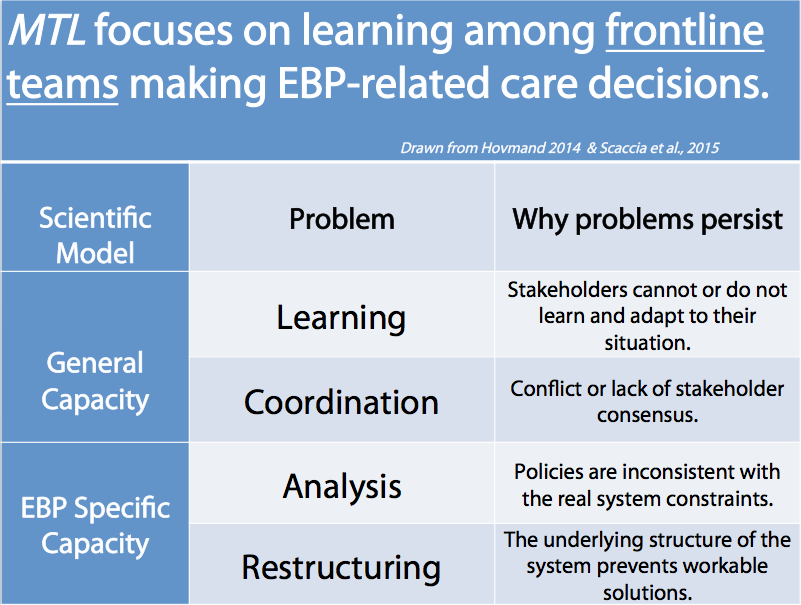
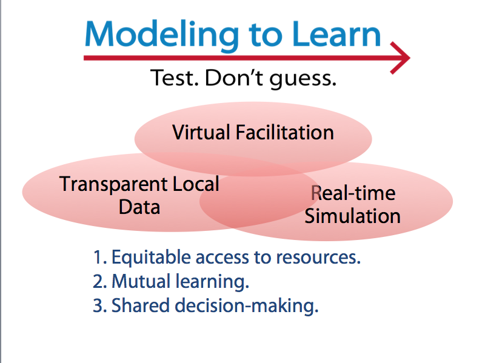
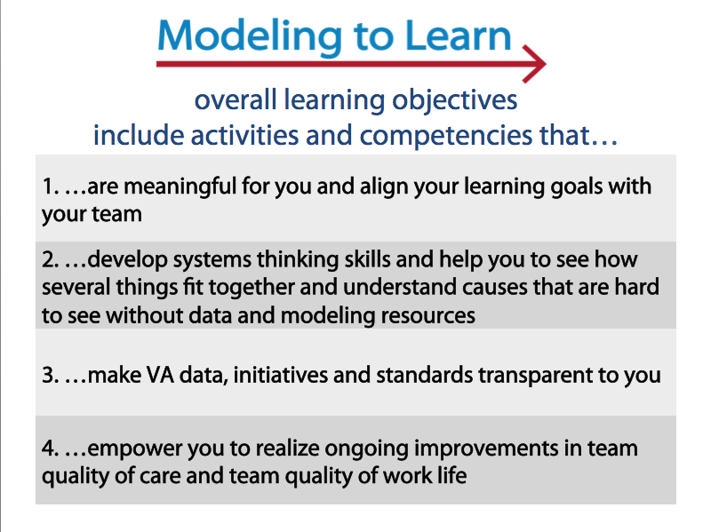
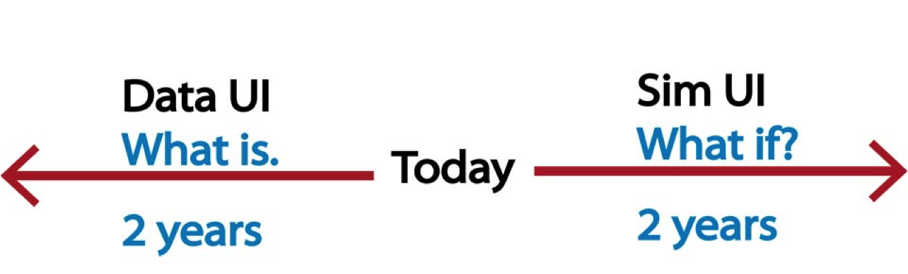
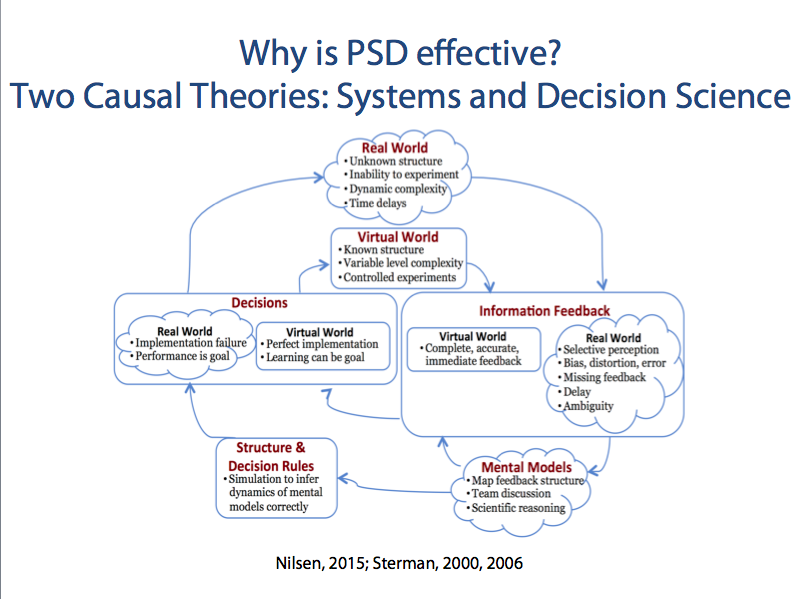
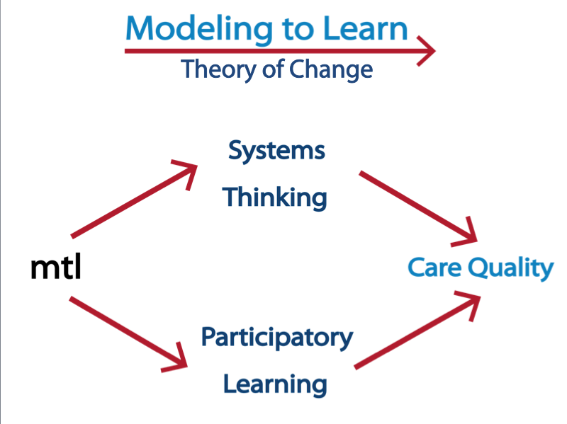

  

# _Modeling to Learn_ Orientation: The images below are used to illustrate key components of _MTL_.

_Modeling to Learn_ Illustrations and Images  
---
Team Capacity Building (team_capacity_building.png) 
---
_MTL_ Multicomponent Strategy (mtl_components.png) 
---
Overarching learning objectives of the _Modeling to Learn_ Program (mtl_overall_learning_obj.png) 
---
What is vs. What if? (data_ui_sim_ui.png) 
---
Two basic causal theories guiding _Modeling to Learn_ (mtl_two_theories.png) 
---
_Modeling to Learn_ Theory of Change (mtl_toc.png)

---
